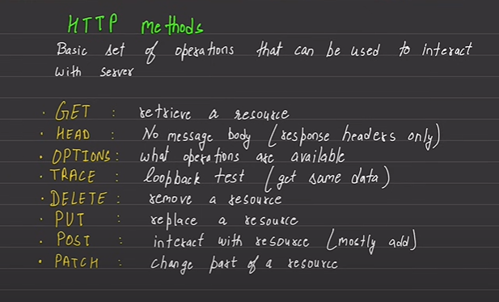
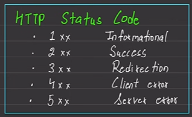

# Started on 28-6-2024

This is my first backend project

# Notes

## Setting up a project

1. we cannot puch empty folders on git, to do this we create a file inside named '.gitkeep'
2. make a '.gitignore' file that will not be pushed on github for security purposes, search gitignore generator on browser and create a file for node project, simply that and paste, can also add extra files as er requirement 
3. create a '.env' file to track environment variables from system (not files)
4. in whole project we want to use 'import' syntax therefore we will add ' "type": "module", ' in package.jason file
5. create a src folder to store all files at seperately
6. we have to reastart our server with every change, to solve this install 'nodemon' this will create a node_modules folder, now remove test and add "dev": "nodemon src/index.js" in scrips section of package.jason
7. create some basic folders in src like: controllers, db, middlewares, models, routes, utils, ...etc
8. install 'prettier' package to resolve later foramtting conflicts;  "npm i -D prettier"
   when you add this prettier package some extra things are to be done as well: 
   1. add '.prettierrc' and '.prettierignore' file in main project 
   2. make nesessary chnages in both the files

## Connecting with data base

1. make cluster in mongo atlas
2. copy its connection string and paste it in .env
    * remove '/' from the end and replace "password" with actual password
3. whenever talking wth database use try-catch and async-await
4. we can write connection code in index.js OR in some other file then import it in index.js for clarity
5. the DB connection func. made here is async func. therefore it will return a promise so we apply then & catch methods

## Uploadation

1. two packages are used : cloudinay and multer
2. filed are stored in cloudinary via multer (not directly)
3. in this project we will first upload files in private server then from there upload it to cloudinary, but we can also skip this process and directly upload files to cloudinary

    * utilities are functions that we can use anywhere , middlewares are func. that we want to call before execution of some process; therefore we will place functions of multer in middlewares

## HTTP

1. it is set of rules of how to share text through internet efficiently 
2. HTTP headers are key-value pairs along with request and response (metadata) that stores info 
3. 
4. 

## Tokens

Toekns are used so that used dont have give credentials again and again
There are two types of tokens: Access(Short lived) and Refresh(Long lived).
When a user login for the first time we give both access and refresh token and also save them in DB, again when user wants to log in we just compare the refresh token, if its same then he can log in without again vrifying all info.
This is done through Refresh token cuz Access token expires early.

## Writing Own Middleware

We made login function by using email, password, username, etc that user gave itself. But, when we have to create logout func. we cannot ask user to again us data again, therefore we will create our own middleware (named: auth) to solve this issue
